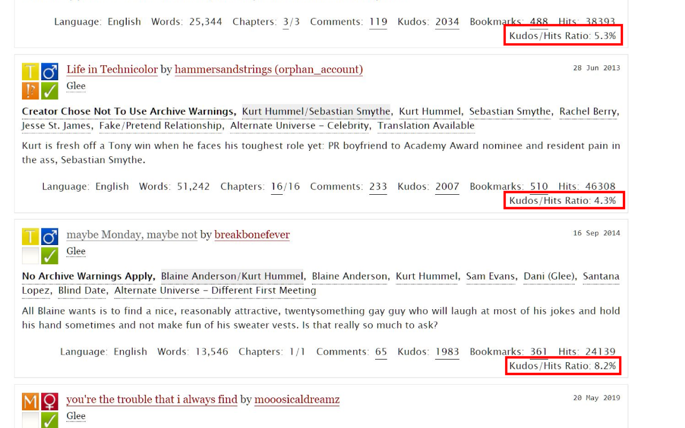
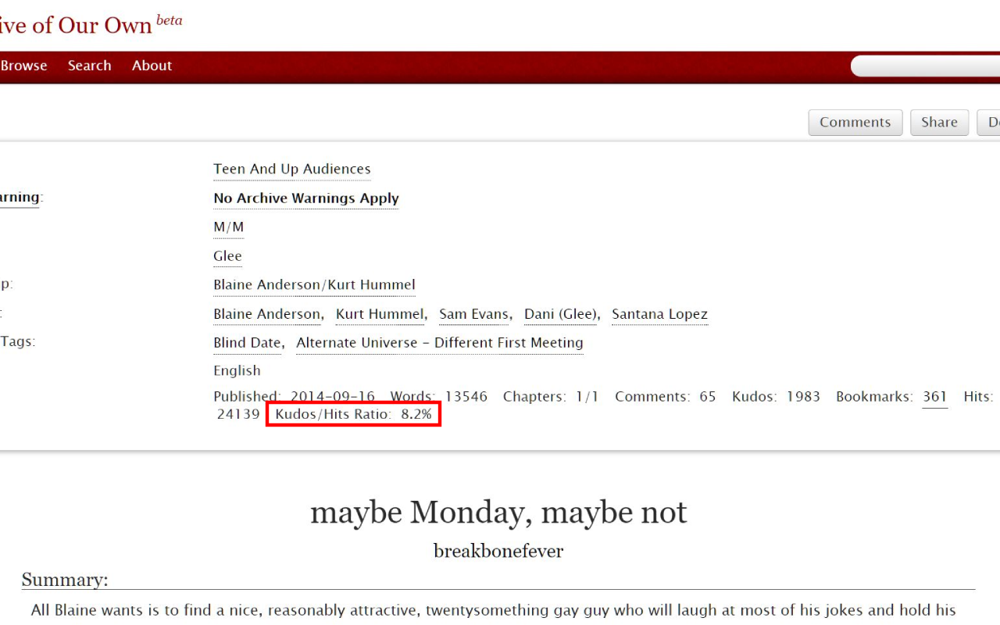

# AO3 Kudos-Hits Calculator
Extension to add kudos-per-hits ratio to stats when viewing works on AO3. An additional metric for calculating quality of works when browsing the site.

## Installation

<ul>
<li><a href="https://chrome.google.com/webstore/detail/ao3-kudos-hits-calculator/hghncnlkonolnnfnebkbnginbaijobki?hl=en/">Install on Chrome</a></li>

<li><a href="https://addons.mozilla.org/en-US/firefox/addon/ao3-kudos-hits-calculator/">Install on Firefox</a></li>
</ul>

## Example Display

